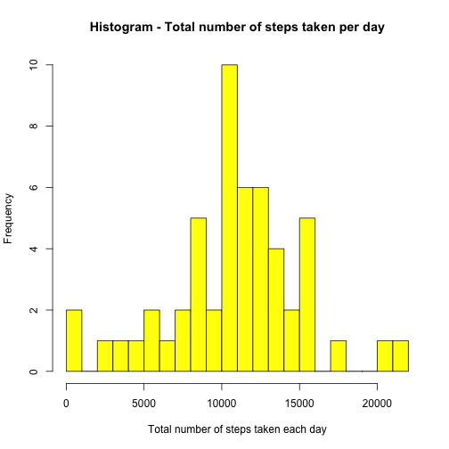
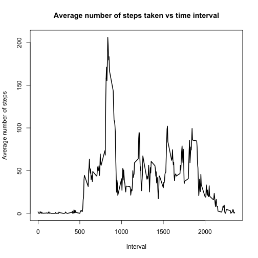
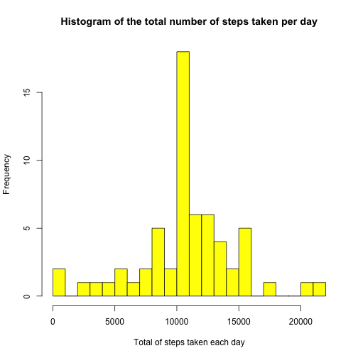
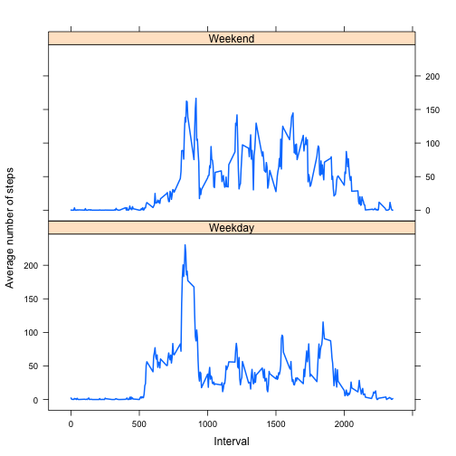

This assisgnment uses the data from collected by a personal activity monitor for the purposes of conducting simple data analytics.  The data is footsteps collected at 5 minute intervals for a period of 2 months in the year of 2012 (Months: November and December).  The assignment loads in our data,  calculates the mean total number of steps taken per day, the average daily activity pattern, does some manipulation around the imputing missing values, and looks at differences in activity patterns between weekdays and weekends.


### Loading and preprocessing the data

Read in the data and process the date into a more friendly field


```r
data <- read.csv("activity.csv", header = TRUE, stringsAsFactors = FALSE, na.strings = "NA")
data$date <- as.Date(data$date)
head(data)
```

```
##   steps       date interval
## 1    NA 2012-10-01        0
## 2    NA 2012-10-01        5
## 3    NA 2012-10-01       10
## 4    NA 2012-10-01       15
## 5    NA 2012-10-01       20
## 6    NA 2012-10-01       25
```

```r
str(data)
```

```
## 'data.frame':	17568 obs. of  3 variables:
##  $ steps   : int  NA NA NA NA NA NA NA NA NA NA ...
##  $ date    : Date, format: "2012-10-01" "2012-10-01" ...
##  $ interval: int  0 5 10 15 20 25 30 35 40 45 ...
```

### What is mean total number of steps taken per day? ###

Clean up the NA's and summaries the number of steps per day.


```r
steps_data <- aggregate(steps ~ date, data, sum, na.action = na.omit)
```

Draw the histogram for the number of steps taken each day


```r
hist(steps_data$steps,breaks = 20, col = "yellow", 
main = "Histogram - Total number of steps taken per day",
xlab = "Total number of steps taken each day")
```

 

Calculate the mean


```r
mean(steps_data$steps)
```

```
## [1] 10766.19
```

Calculate the median


```r
median(steps_data$steps)
```

```
## [1] 10765
```

### What is the average daily activity pattern? ###

Firtly we need to calculate the average number of steps taken for each time interval.


```r
average_by_interval <- aggregate(steps ~ interval, data, mean, na.action = na.omit)
```

Draw the plot.

```r
with(average_by_interval, plot(interval, steps, type = "l", lwd = 2, 
           xlab = "Interval", ylab = "Average number of steps", 
           main = "Average number of steps taken vs time interval"))
```

 

Getting the max interval and max steps

```r
index <- with(average_by_interval, which.max(steps))
max_interval <- average_by_interval[index, "interval"]
max_steps <- average_by_interval[index, "steps"]
index
```

```
## [1] 104
```

```r
max_steps
```

```
## [1] 206.1698
```

```r
max_interval
```

```
## [1] 835
```

### Imputing missing values  ###

Calculate the number of NA's


```r
sum(is.na(data))
```

```
## [1] 2304
```

The stategy is to replace the NA's with the average number of steps taken over all days in each interval.


```r
updated_data <- data
for (i in 1:nrow(data)) {
     if(is.na(data[i,"steps"])) {
        interval <- data[i,"interval"]
        index <- which(interval == average_by_interval[,"interval"])
        updated_data[i,"steps"] <- average_by_interval[index , "steps"]
     }
}

steps_perday_updated <- aggregate(steps ~ date, updated_data, sum)
```

Histogram of the new updated data.


```r
hist(steps_perday_updated$steps,breaks = 20, col = "yellow", 
      main = "Histogram of the total number of steps taken per day",
      xlab = "Total of steps taken each day")
```

 

Mean and Median of the new dataset


```r
mean(steps_perday_updated$steps)
```

```
## [1] 10766.19
```

```r
median(steps_perday_updated$steps)
```

```
## [1] 10766.19
```

There is only a very small impact by imputing the values replacing the NA's with the average.

### Are there differences in activity patterns between weekdays and weekends? ###

Creating a new factor variable in the dataset with two levels – “weekday” and “weekend” indicating whether a given date is a weekday or weekend day.

In order to address the question we create a new column to indicate weekdays.


```r
updated_data$date <- as.Date(updated_data$date)
updated_data$day_type <- weekdays(updated_data$date)

weekdays <- c("Monday", "Tuesday", "Wednesday", "Thursday", "Friday")

for(i in 1:nrow(updated_data)) {
     if(any(updated_data[i, "day_type"] == weekdays)) {
         updated_data[i, "day_type"] <- "Weekday"
     }
     else {
         updated_data[i, "day_type"] <- "Weekend"                
     }
 }

updated_data$day_type <- factor(updated_data$day_type, levels = c("Weekday", "Weekend")) 

str(updated_data)
```

```
## 'data.frame':	17568 obs. of  4 variables:
##  $ steps   : num  1.717 0.3396 0.1321 0.1509 0.0755 ...
##  $ date    : Date, format: "2012-10-01" "2012-10-01" ...
##  $ interval: int  0 5 10 15 20 25 30 35 40 45 ...
##  $ day_type: Factor w/ 2 levels "Weekday","Weekend": 1 1 1 1 1 1 1 1 1 1 ...
```

```r
weekdays <- aggregate(steps ~ interval + day_type, updated_data, mean)
```

Now we can make the series plot.


```r
library(lattice)
```

```
## Warning: package 'lattice' was built under R version 3.1.2
```

```r
xyplot(steps ~ interval | day_type, weekdays, layout = c(1, 2),
        xlab = "Interval", ylab = "Average number of steps", 
        type = "l", lwd = 2)
```

 

From these plots we can see that the distrobution through the days is infact different.  It appears that there is more activity in the mornings for the weekdays then the activity lower.  On the weekends there seem to be more activity spread out throughout the day.
